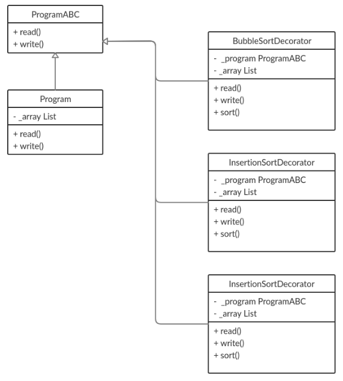

# decorator-and-sorting

## [OTUS](https://otus.ru) homework

### Goals
Implement OOP pattern "Decorator"

### Description
There is a program which reads array from one file and writes it to another file.
There are some decorators which sort an array before it will be written to file.

### Class schema



### Decorator
If the program supports a sort type the program will delegate **writing** of the array to a decorator.
```python
if sort_type == Sorting.bubble.value:
    BubbleSortDecorator(program).write(write_to)
elif sort_type == Sorting.selection.value:
    SelectionSortDecorator(program).write(write_to)
elif sort_type == Sorting.insertion.value:
    InsertionSortDecorator(program).write(write_to)
else:
    print(f'Sorting program does not support "{sort_type}" sorting')
    program.write(write_to)
```

Also is can be a chain of the decorators.
```python
BubbleSortDecorator(SelectionSortDecorator(InsertionSortDecorator(program))).write(write_to)

# "Bubble sort" used
# "Selection sort" used
# "Insertion sort" used
```

To run program:
```bash
$ python program_1.py
```

To run tests:
```bash
$ python -m unittest tests
```